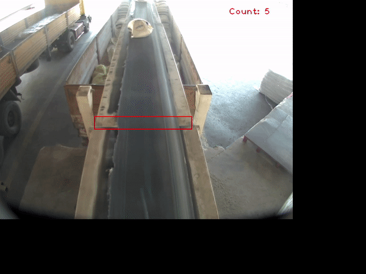

# bag-detection-counter
Python app that detects Flour bag in a conveyor belt using OpenCV, to count the bags whenever they get to a specific area. 

## Resulting Output


## Requirements 
```bash
numpy==1.19.5
opencv_python==4.5.5.62
```